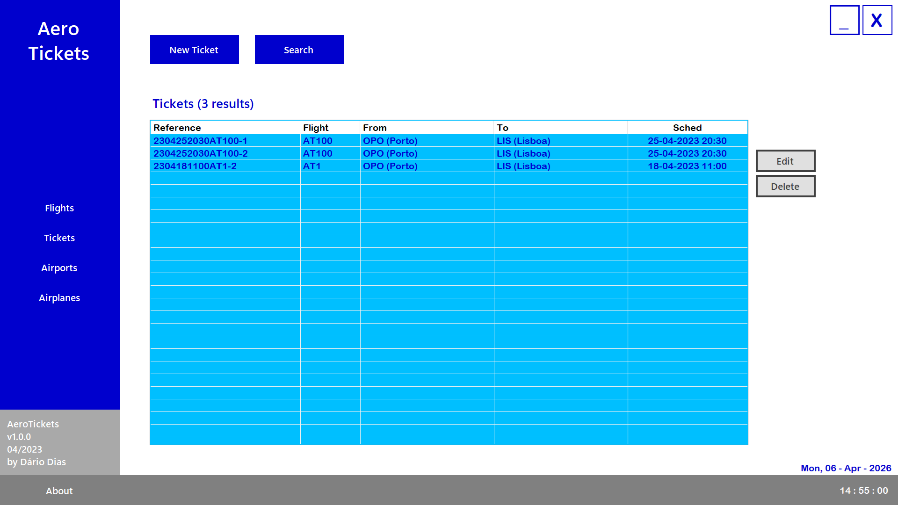
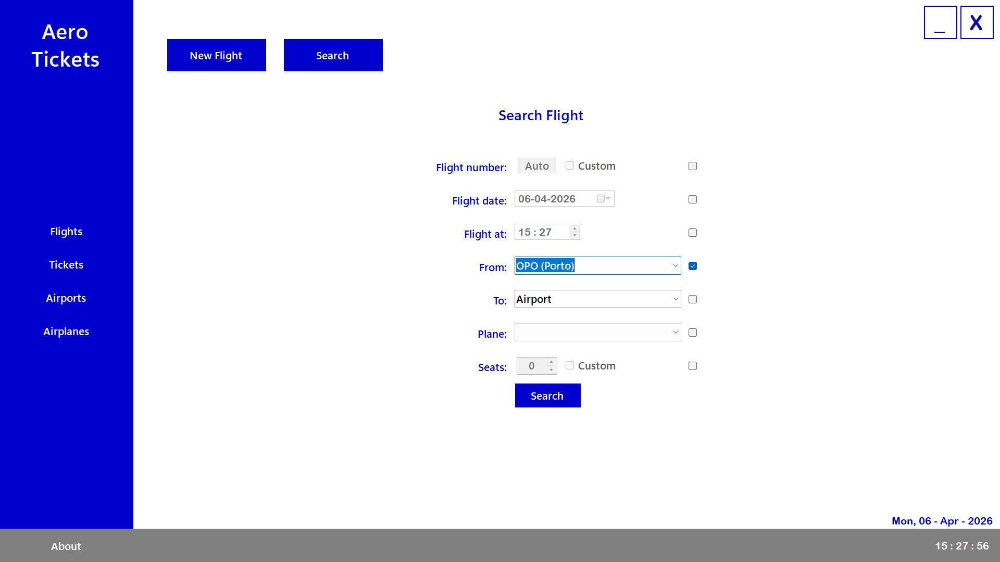
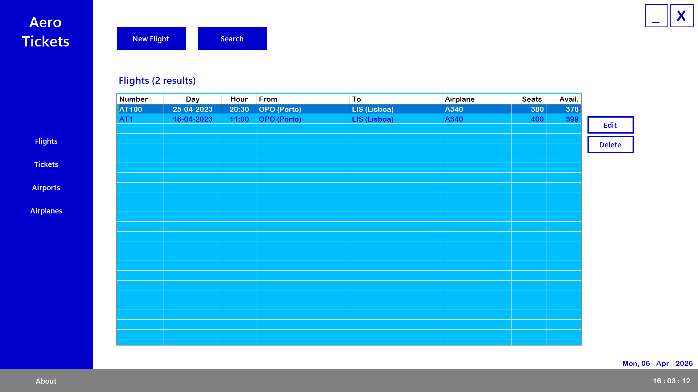
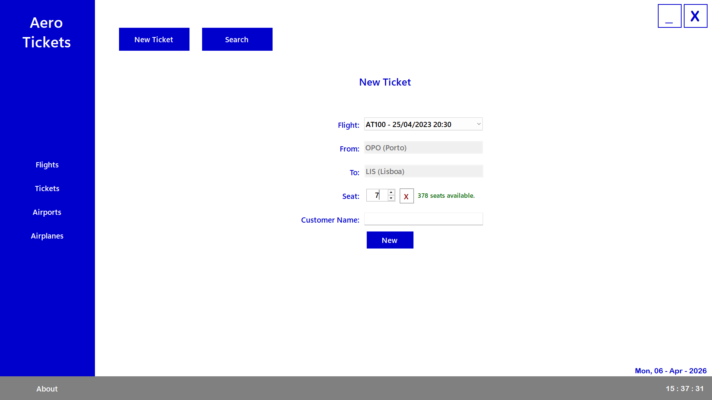
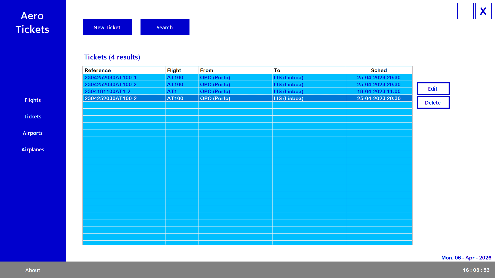
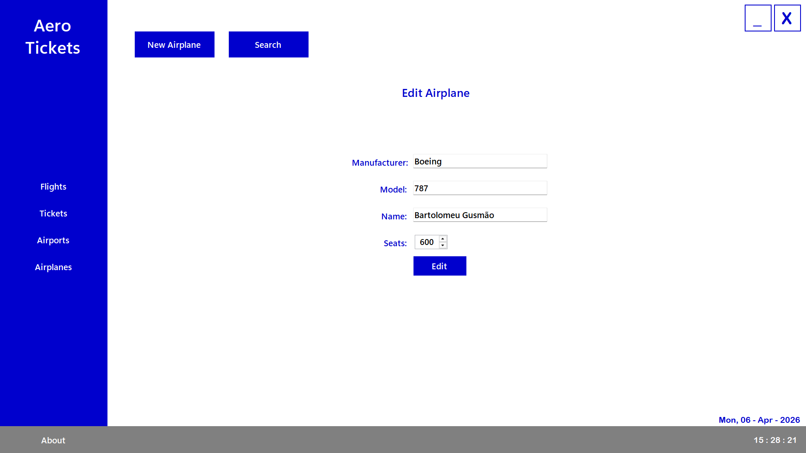
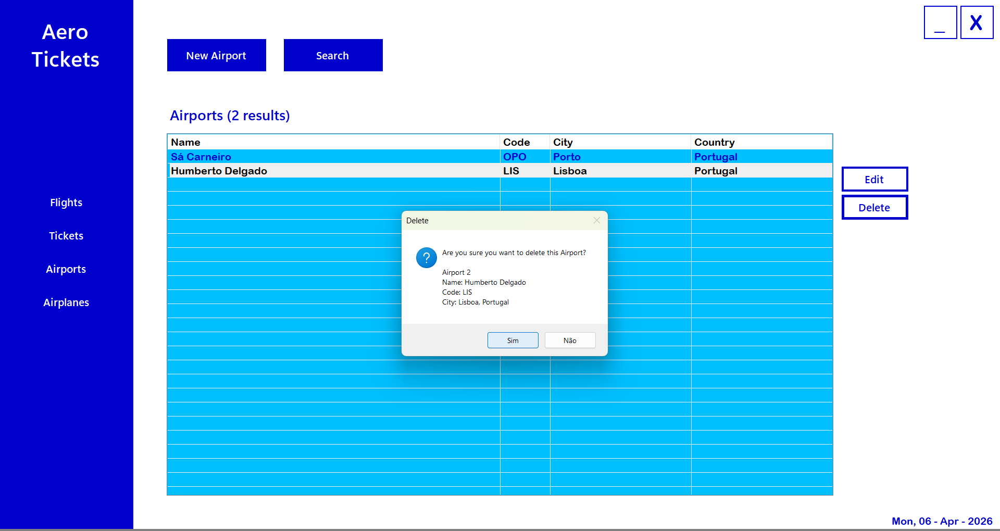

# ✈️ AeroTickets

AeroTickets is a .NET 6 WinForms desktop application developed as part of a professional training course.

## 📌 Project Overview

This application simulates an airline management system.
This is the first project in the course intended to simulate a real-world use desktop application.
It allows users to manage Airports, Airplanes, Flights and Tickets.
Data persistence is achieved through a set of XFiles, whose management is coded in the project.

---

## 🚀 Features

* ✈️ CRUD: Airport, Airplane, Flight and Ticket
* 🖥️ Interactive Windows Forms UI
* 📋 Improved search and data manipulation

---

## 📂 Project Structure

```
AeroTickets/
│── AeroTickets.sln                     # Solution file
│
│── AeroTickets.ClassLibrary/           # Data model and manipulation classes
│   │── Models/                         # Data classes
│   │── AT_Checks.cs                    # Validation methods
│   │── AT_Constants.cs                 # Utility constants
│   │── IXFiles.cs                      # XFiles interface
│   │── XFiles.cs                       # Data management (using .txt files)
│
│── AeroTickets.WinForms/               # Main WinForms project
│   │── UserControls/                   # Partial forms (UI)
│   │── Form1.cs                        # Main Form
│   │── Program.cs                      # Entry point
│
│── README.md
```

---

## ⚙️ Installation & Setup

(Requires Visual Studio with .NET 6 installed)


Clone the repository:
* git clone https://github.com/Dario-97-d/AeroTickets.git

Open the solution:
* Open AeroTickets.sln in Visual Studio

Build and run:
* Press F5 or click Start in Visual Studio

---

## 📸 Screenshots

### Start Screen

The About dropup is toggled on click. It starts closed, but is opened here to show the content.



### Search Flight

Flights may be found by searching for specific fields.



### Flight Selection

Double-clicking a flight opens the new Ticket form, with the Flight already selected.



### New Ticket

Seat 7 is taken.



Seat 6 is available.


### Ticket List

The newly created ticket is listed here.



### Editing an Airplane



### Deleting an Airport

Deleting any data requires confirmation.


